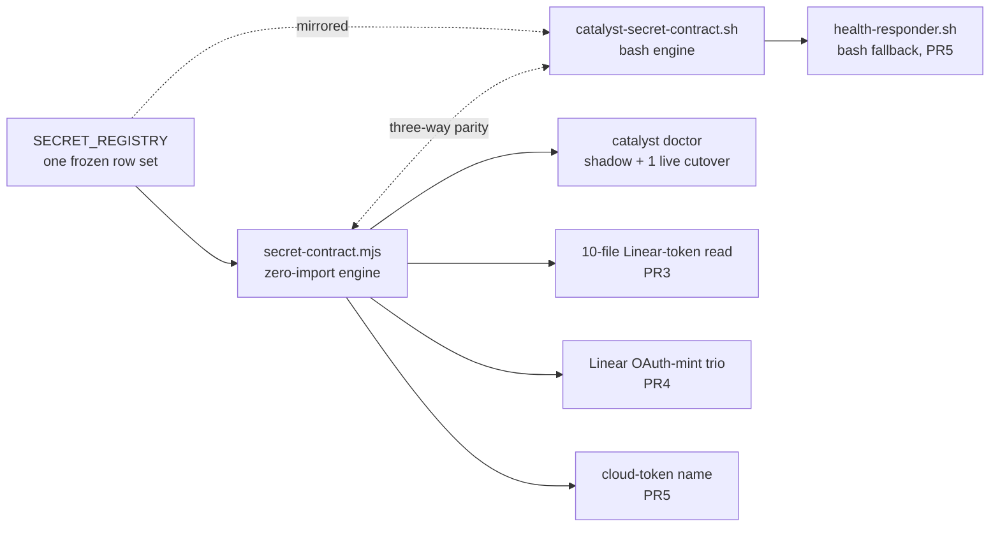
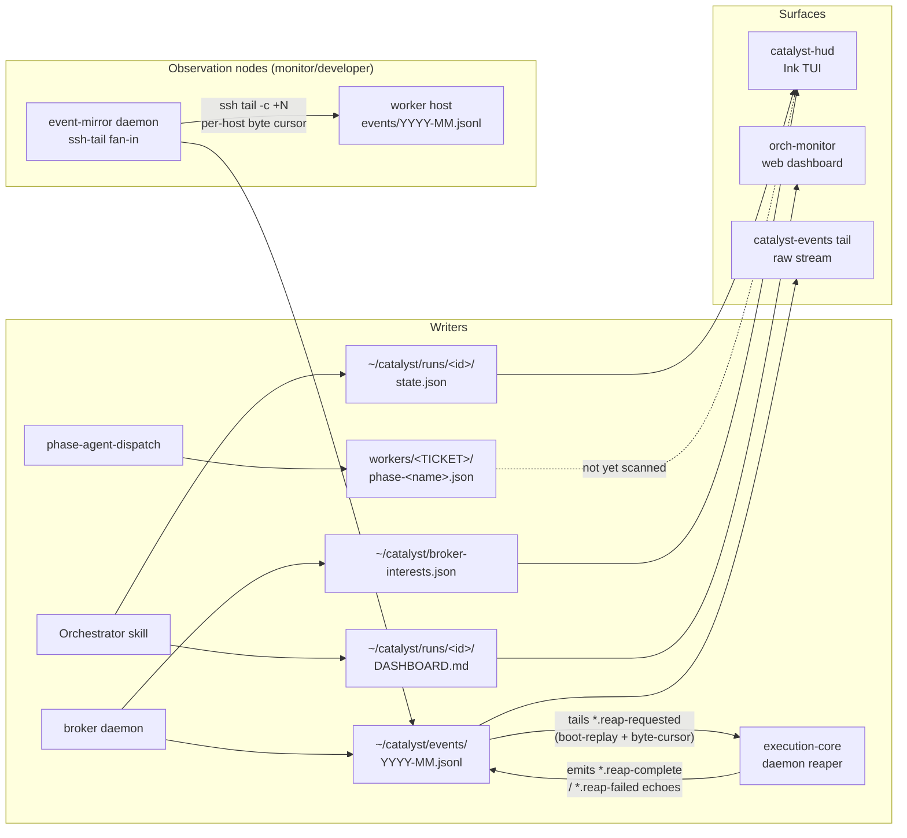

# Architecture

For the local Linear writer, freshness gate, read tiers, configuration order, and health signals,
see [Linear read replica](linear-replica.md).

## Three-Layer System

1. **Plugin Source** (`plugins/dev/`, `plugins/meta/`, `plugins/pm/`, `plugins/legacy/`, …) —
   canonical agent/skill definitions; edit these.
2. **Installation Layer** — `.claude/` (symlinks Claude Code reads plugins from) + `.catalyst/`
   (workflow state: `config.json`, `.workflow-context.json`).
3. **Thoughts System** — external git-backed context at `~/thoughts/`, shared across worktrees,
   initialized per-project via `init-project.sh`.

## Memory & Workflow State

Three memory layers manage context across projects:

1. **Project config** (`.catalyst/config.json`, committable) — ticket prefix, Linear team, etc.
   HumanLayer maps cwd → profile via `repoMappings`.
2. **Long-term memory** — HumanLayer thoughts repo (git-backed, synced via
   `humanlayer thoughts sync`): `shared/research/`, `shared/plans/`, `shared/prs/`,
   `shared/handoffs/`.
3. **Short-term memory** (`.catalyst/.workflow-context.json`, per-worktree, not committed) —
   pointers to recent docs enabling skill chaining:
   `/research-codebase`→`/create-plan`→`/implement-plan`, `/create-handoff`→`/resume-handoff`.
   Auto-updated by workflow skills.

```
.catalyst/config.json              <- project config (committable)
   ↓
~/thoughts/repos/<proj>/{research,plans,prs,handoffs}/   <- long-term (git-backed)
   ↓
.catalyst/.workflow-context.json   <- short-term (session pointers)
```

`.workflow-context.json` structure:
`{lastUpdated, currentTicket, orchestration, mostRecentDocument:{type,path,created,ticket}, workflow:{research[],plans[],handoffs[],prs[]}}`.

## Global Orchestrator State

Cross-orchestrator visibility lives at `~/catalyst/state.json` — a single lock-protected JSON file
all orchestrators/workers write via `catalyst-state.sh`. It is a **denormalized summary**;
per-orchestrator local state in worktrees stays the source of truth for crash recovery (ADR-006).

```
~/catalyst/
├── state.json              # active orchestrators (denormalized summary)
├── catalyst.db             # durable SQLite session store (WAL)
├── events/YYYY-MM.jsonl    # append-only JSONL event stream, rotated monthly
├── history/<id>--<ts>.json # archived orchestrator snapshots
├── execution-core/registry.json  # team → repoRoot → eligibleQuery registry
└── wt/                     # worktrees
```

- **catalyst.db** — durable session source of truth (solo + orchestrated). Managed by
  `catalyst-db.sh` (CRUD/migrations) and `catalyst-session.sh` (lifecycle CLI). Tables: `sessions`,
  `session_events`, `session_metrics`, `session_tools`, `session_prs`, `schema_migrations`. WAL mode
  → concurrent readers (incl. `orch-monitor`). Schema: `plugins/dev/scripts/db-migrations/`.
  ADR-008. `catalyst-state.sh` still writes JSON/JSONL during the migration period for backward
  compatibility, so SQLite and the JSONL log coexist.
- **state.json** — active-orchestrator registry (progress, worker status, attention items). Schema:
  `plugins/dev/templates/global-state.json`.
- **events/** — every phase transition, PR creation, verification result, attention item. Schema:
  `plugins/dev/templates/global-event.json`. Multiple writers, two envelope shapes coexisting:
  - **v1** (bash, `catalyst-state.sh event`): `{ts, event, orchestrator, worker, detail}`.
  - **v2 OTel** (`plugins/dev/scripts/orch-monitor/lib/webhook-events.ts` for `github.*`/`linear.*`;
    `catalyst-comms send` for `comms.message.posted`): `{ts, attributes, body, resource}`.
  - Consumers: `catalyst-events tail` (stream), `catalyst-events wait-for` (blocking single-event).
    Both shapes handled. See `website/src/content/docs/observability/catalyst-events.md`.
- **history/** — full snapshots archived on completion/failure/stale.
- **execution-core/registry.json** — for `dispatchMode: execution-core` teams, the central
  `team → repoRoot → eligibleQuery` registry. The Linear-state contract is setup-tooling-owned (D8):
  `setup-catalyst.sh` ensures contract workflow states, writes the phase→5-state `stateMap`, and
  upserts each team's entry. Daemon reads the registry directly (D4). The CTL-554 per-repo
  enrollment under `execution-core/projects/` and the `/orchestrate` enroll step were retired in
  CTL-582. Access flows through `registry.mjs` `list-projects`/`get-project-config` — the D9 cloud
  seam (swappable to a hosted table without touching callers).
- **Heartbeat** — orchestrators write `lastHeartbeat` every 2–3 min; entries stale >10 min are GC'd
  as `abandoned`.

**Cross-host ticket ownership (HRW + liveness, CTL-859 → CTL-1091).** In a multi-host cluster,
ticket ownership is partitioned by Highest-Random-Weight (rendezvous) hashing (`hrw.mjs` `ownedBy`):
each daemon acts only on the tickets it owns, so one ticket is considered by exactly one host. Two
gates evaluate ownership, and — since CTL-1091 — **both hash over a liveness-filtered roster**, so an
offline owner's slice fails over to a live host instead of stranding in Todo forever:

- **Dispatch gates** (new-work `ready` filter in `scheduler.mjs`; triage predicate in `monitor.mjs`)
  hash over the **dispatch roster** = `computeDispatchSurvivingRoster(roster)` (POSITIVE liveness —
  a host must have heartbeated within `HEARTBEAT_GRACE_MS`, so a *never-live* rostered host is shed;
  CTL-1057) with a restore-side **deflap** on top (`liveness-deflap.mjs` `computeDispatchRoster` —
  a dead→live host is held out for `HEARTBEAT_RESTORE_HOLD_MS` so a flapping laptop can't
  grab-then-strand work; scheduler is the sole writer of `.liveness-deflap.json`, monitor reads it).
- **Recovery gates** (`ownsForRecovery`, `reclaimDeadHostWork`) hash over the **surviving roster** =
  `computeSurvivingRoster(roster)` (fail-OPEN `deadHosts` — an unseen host is "not proven dead" and
  is NOT reclaimed, since a never-seen host has no work to reclaim). The asymmetry is deliberate:
  dispatch fails an unseen owner's slice **over**; recovery must not reclaim a host's non-existent work.

Both altitudes preserve the single-host no-op. A transient total-liveness outage degrades to the
**full roster**. After five minutes, dispatch defaults to the persisted last-known-good live roster;
`catalyst.cluster.dispatchOutageFallback: "full-roster"` explicitly opts back into the old sustained
outage behavior. A cold start with no last-known-good set remains on the full roster rather than
using `[self]`, which would make every host own every ticket. The Linear-CAS claim
(`cluster-claim.mjs` soft-CAS on `catalyst://fence/<TICKET>`, applied HRW-first/claim-second) remains
the transition-race serializer.

The daemon boot announcement reports `ownsRawRoster` and `ownsDispatchRoster`; only the latter
reflects live dispatch ownership. Board health's `strandedNode` invariant is liveness-driven.
Team-level reconcile failures remain visible as context but never authorize takeover of another
host's work.

**Worker signal projection (CTL-532 = ADR-018 Phase 3, shipped; Phase 1 retired, CTL-1628).**
Per-worker `workers/<TICKET>.json` files are still written by ~7 scripts with no inter-process
locking; ADR-018 originally proposed closing that gap via a `worker.state_changed` command event and
a JSON shadow file with a three-phase dual-write cutover. Phase 1 (the JSON shadow-write mechanism)
stalled at 1 of 7 writers migrated and was retired as dead weight — its only reader was the manual
`orchestrate-shadow-diff` verification CLI, removed with it; nothing operational ever consumed the
shadow files. Phase 2's plan (cut over to broker-sole-writer once Phase 1 reached zero drift) is
dead — it depended on the now-retired Phase 1 drift-check pipeline. The *problem* Phase 2 was meant
to solve — the seven-script single-writer race — is still open, but it is no longer tracked as this
ADR's Phase 2: **CTL-1631** now owns it as a standalone ticket, replacing the retired Phase-2 plan
rather than continuing it. Phase 3 — as originally scoped, a `(orch_id,ticket)` SQLite mirror —
**did ship**, as **CTL-532**: the broker
folds every event on the log (not just a dedicated command event) into a pure
`reduceWorkerStateEvent` reducer via `projectWorkerStateEvent`, and upserts the result into a SQLite
`worker_state` table (`broker/broker-state.mjs`) — one row per `(orchestrator, ticket)` with phase,
status, PR number, and revive count. Only `phase`/`status` (and the `last_event_id`/`last_event_ts`
watermark itself) are gated on that watermark — order-independent for distinct timestamps,
last-write-wins by processing order on an exact tie; `pr_number` (COALESCE) and `revive_count` (MAX)
apply unconditionally on every upsert regardless of event order. The table is purely observational —
it never reads or writes the canonical `workers/<TICKET>.json`. See ADR-018 for the full history.

## Deployment Mode (CTL-1617)

One declared answer — **`catalyst.deployment.mode` ∈ `single-host` | `cluster` | `cloud`** — replaces
the per-host hand-wiring of mode-dependent choices. Resolved by a zero-import bash+JS pair
(`plugins/dev/scripts/lib/deployment-mode.mjs` + `lib/catalyst-deployment-mode.sh`), kept honest by
an exhaustive cross-stack parity fixture matrix (`__tests__/deployment-mode-parity.test.sh`). The
schema itself (precedence ladder, examples, defaulting, every caveat) lives in its canonical
reference, `website/src/content/docs/reference/configuration.md` — this section covers only the
architectural role. **This repo's Layer-1 declares `cluster`**; dev-clones override to `single-host`
via Layer-2.

- **Degradation is the safety direction**: invalid values settle at their layer as
  `single-host, recognized:false` (asserting the fewest cross-host guarantees); malformed files are
  layer-absent in BOTH languages. Two supported, deliberate asymmetry bounds: on a **jq-less host**
  the bash resolver treats config files as absent (env-else-default, with a
  `CATALYST_DEPLOYMENT_MODE_JQ_MISSING` breadcrumb for doctor) while the JS resolver still reads
  them; and file-acceptance parity is defined by jq's parser (multi-document, BOM, and
  lone-surrogate-escape documents are whole-document-malformed on both sides — the JS reader scans
  raw text to match).
- **Consumers today**: `catalyst doctor` (`checkDeploymentModeConsistency`, advisory:
  declared/inferred, typo FAIL, roster-consistency WARN — every message says "deployment mode",
  never bare "mode", since `dispatchMode`, executor dispatch-mode telemetry, and the replica
  reader's `mode` are unrelated concepts) and the orch-monitor smee tunnel gate (a declared-`cloud`
  node suppresses tunnel start; the replacement cloud-SDK event connection is **future work** — the
  smee→cloud cutover, ADR-0008 lineage — so `cloud` today means "no smee ingestion", not "cloud
  ingestion wired"). **Consumer**: the CTL-1616 secret contract's provider-of-record dispatch
  (below) can receive the full resolution object and never activates a cloud provider on
  `inferred:true` — but only `catalyst doctor` actually threads `deploymentMode` into its
  `resolveSecret` calls today. The folded Linear/OAuth call sites (`linear-query.mjs`,
  `cluster-claim.mjs`, etc.) call `resolveSecret(id)`/`resolveSecret(id, { env })` with no
  `deploymentMode` argument at all, so the cloud guard never engages for them regardless of the
  node's declared mode — deployment-mode dispatch for those consumers stays **planned**, not
  shipped (see the Secret Contract section below).
- **Orthogonal axes, never merged**: deployment mode (fleet topology) × `catalyst.node.class`
  (per-machine role: `worker` runs the full execution layer; `monitor`/`developer` run observation
  substrate only — broker + monitor + event-mirror, no heartbeat/dispatch/recovery) ×
  `orchestration.dispatchMode` (process substrate within a node).
- Design + migration plan: `thoughts/shared/research/2026-08-02-ctl-1617-deployment-mode-design.md`.

## Secret Contract (CTL-1616)

The 2026-08-02 fleet 401 outage was four divergent hand-written copies of one secret-resolution
chain. CTL-1616 generalizes CTL-1612's proven github-token/webhook-secret pair into **one
registry, two engines**: `plugins/dev/scripts/lib/secret-contract.mjs` (a zero-import JS leaf —
`node:fs`/`os`/`path` only, so `catalyst doctor`'s bare-Node runtime can import it without pulling
in `execution-core/config.mjs`'s `bun:sqlite` graph) and its independently-maintained bash mirror
`lib/catalyst-secret-contract.sh`, held honest by a cross-stack **three-way parity suite**
(`__tests__/secret-contract-parity.test.sh`: bash and JS each checked against a
computed-expected value, never merely against each other, plus row-id-set equality between the
two registries). The schema — the 11 registered secrets, the 7 delivery types, the resolution
result shape, the cloud guard, and the Layer-2 path chain — is documented in full in its canonical
reference, `website/src/content/docs/reference/configuration.md`; this section covers only the
architectural role.



**Bootstrap classes, one per deployment mode** — the one credential the contract can never itself
deliver, since it is what unlocks (or stands in for) everything else the chain resolves:

| Mode          | Bootstrap credential                          | Row              |
| ------------- | ---------------------------------------------- | ----------------- |
| `single-host` | none — every secret is operator-placed          | — (no row)         |
| `cluster`     | the SOPS age private key (`~/.config/catalyst/age.key`, `SOPS_AGE_KEY_FILE`-overridable) | `age-key` (`local-only`, presence-checked, value never read) |
| `cloud`       | `CATALYST_CLOUD_TOKEN` (name itself resolvable via a 3-tier ladder) | `cloud-token` (`platform-env`) |

**Rotation classes** generalize `cluster-sync.mjs`'s "captured at process start" prose into
structured per-row data: `boot-only` (a value change needs a restart), `re-armable`/`timer`
(proactively re-checked on a recurring tick — `github-token`'s declared shape; its actual re-arm
today still runs through the pre-existing CTL-1612 `rearmGithubTokenFromFile`, called every
daemon cluster-sync tick in `execution-core/daemon.mjs`, not yet through this contract's own
`registerRearmHook`/`armSecret` seam), and `re-armable`/`on-401`
(reactively re-minted on an observed auth failure — the Linear OAuth-mint shape). `armSecret()`
never throws and reports `{ armed, rotated, restartRequired }` — `restartRequired: true` is the
literal mechanism the 2026-08-02 outage lacked: a `boot-only` row (or a `re-armable` row with no
hook registered yet — the two degrade identically, by design, so a consumer that never wires the
arm path can't look safer than one that structurally can't) reports it when a caller invokes
`armSecret` and the resolved value has changed since the PROCESS's last `armSecret` observation
for that id (`_lastArmedValue` is module-level, one baseline per secret id shared by every caller
in the process — caller B observing a rotation resets what caller A sees) — a caller-invoked
report, not an automatic one fired the moment the value changes. No production call
site invokes `armSecret` today (a repo-wide search outside tests finds only the definition and a
comment reference in `linear-remint.mjs`), so this reporting is not yet wired to any running
daemon.

**Consumers folded onto the contract so far**: the 10-file/12-site Linear-token read
(`linear-query.mjs` — 3 sites, `cluster-heartbeat.mjs`, `cluster-claim.mjs`,
`linear-estimation-method.mjs`, `linear-reconcile-cli.mjs`, three `orch-monitor/lib/linear-*`
fallback readers, `score-tickets.ts`, and the bash `catalyst_resolve_secret linear-api-token`
snippet in `plugins/dev/skills/phase-triage/SKILL.md`); the Linear OAuth-mint trio
(`linear-app-actor.sh`'s bash mint, `linear-remint.mjs`'s orchestrator-actor reminter — registered
as the row's live rearm hook — and `linear-comment-post.sh`'s worker-actor chain, legacy tiers
preserved verbatim); the cloud-token env-var **name** resolver (`config.mjs`'s
`resolveNodeCloudTokenEnv` now delegates directly to `resolveCloudTokenName`; `health-responder.sh`'s
bun-less fallback path instead calls the independently-maintained bash mirror
`catalyst_secret_cloud_token_name` — kept byte-for-byte with the JS resolver by the parity suite,
not a shared function call); and
`catalyst doctor` itself, which consults the contract through `resolveSecret` directly rather
than a parallel presence check — as a **shadow**
comparison (INFO-only, never changes a grade) for most checks, with `checkPeerUniqueness` /
`checkBotCredentials` / `checkWorkerLabels` cut over to the contract as their *live*
`linear-api-token` answer, and one grade-changing addition: `checkCloudTokenEnv` now FAILs when the
active deployment mode is declared `cloud` and the `cloud-token` bootstrap row doesn't resolve —
the one FAIL doctor cannot route around. The GitHub-token/webhook-secret pair that motivated the
contract (CTL-1612's `catalyst-secret-env.sh` / `github-auth-preflight.mjs`) has **not yet** been
re-pointed onto the shared engine — both rows exist in the registry today for shadow comparison and
future consumers, but the live CTL-1612 code path is still its own, pre-existing implementation.

The same PR5 that unified the cloud-token name resolver did adjacent, unrelated cleanup on Groq's
`GROQ_API_KEY` ladder (`dsl-cli.mjs` and `hud.tsx` joined `broker/config.mjs` on the shared
`resolveApiKey`) — but that is `lib/api-key-health.mjs`'s pre-existing (CTL-343) resolver, not this
contract: none of those three call sites import `secret-contract.mjs`, and the registry's own
`groq-api-key` row has no consumer today besides `checkSecretContract`'s shadow-only observation.

**Secret-env hygiene rule**: the bash engine's `_csc_set_result` exports the non-secret
`CATALYST_SECRET_LAST_SOURCE`/`_PROVIDER` breadcrumbs for the calling shell's convenience but
**never** exports the resolved value itself (`CATALYST_SECRET_LAST_VALUE` stays same-shell-only,
with `export -n` reasserted on every call since bash's export attribute is sticky across
reassignment) — a long-lived daemon shell must not leak a credential into every child process it
launches.

## Agent Teams vs Subagents

| Scenario                                        | Subagents       | Agent Teams |
| ----------------------------------------------- | --------------- | ----------- |
| Parallel research / code analysis / file search | YES             | overkill    |
| Complex multi-file implementation               | NO (can't nest) | YES         |
| Cross-layer features (FE+BE+tests)              | NO              | YES         |
| Cost-sensitive                                  | YES             | NO          |

- **Subagents (Task tool)** — own context window, results return to caller; cannot nest; lower cost.
  Default for research/analysis/search.
- **Agent Teams (TeammateTool, `CLAUDE_CODE_EXPERIMENTAL_AGENT_TEAMS=1`)** — each teammate is a full
  session that CAN spawn its own subagents (two-level parallelism); peer messaging; higher cost. For
  cross-layer/complex work.

Best practices: lead on Opus, teammates on Sonnet; ~5–6 tasks/teammate; each teammate owns distinct
files; plan-approval gates for risky work.

## Agent Communication (catalyst-comms)

File-based JSONL messaging at `~/catalyst/comms/channels/<name>.jsonl`. Bidirectional (CTL-249):
orchestrators broadcast to and directly message individual workers; workers poll for directed
messages at each phase boundary. `catalyst-comms send` also emits a `comms.message.posted` v2 event
to the unified log, so monitoring tools and `catalyst-events wait-for` observe comms from the same
file as GitHub/Linear events.

```bash
catalyst-comms join "$CHANNEL" --as <id> [--as orchestrator|--parent orchestrator]
catalyst-comms send "$CHANNEL" "msg" --as orchestrator --to CTL-101 --type info
catalyst-comms poll "$CHANNEL" --filter-to "$TICKET_ID" --since "$LAST_READ"
catalyst-comms watch "$CHANNEL"   # live tail (human auditor)
```

(Legacy `/oneshot` worker examples now live in the `plugins/legacy` plugin — see Phase-Agent
Communication for the current model.) Contract: every worker produces ≥4 messages/run. Signal files
remain authoritative state; comms is observability + coordination. Full protocol:
`plugins/dev/skills/catalyst-comms/SKILL.md`.

## Phase-Agent Communication

In `dispatchMode = "phase-agents"` (template default; also used internally by the `execution-core`
daemon) the orchestrator spawns one short-lived `claude --bg` job per phase, walking the 10-phase
pipeline (triage → research → plan → implement → verify → review → pr → monitor-merge →
monitor-deploy → teardown — see `docs/orchestrator-overview.md`). Phase agents never message each
other; they **append typed events to the shared log** `~/catalyst/events/YYYY-MM.jsonl`. The
orchestrator wakes on those events via the broker (`filter.wake.<ORCH_NAME>`), advances the ticket
via `orchestrate-phase-advance`, and dispatches the next `--bg` job. Dispatcher:
`plugins/dev/scripts/phase-agent-dispatch` (CTL-448). `oneshot-legacy` (single long-lived
job/ticket) is the runtime fallback when the key is missing.

### Publish-capability preflight and the push remote (CAT-60)

GitHub access is asymmetric: cloning, fetching, and reading a repository can succeed for an identity
that cannot publish a branch there. Catalyst resolves the write target separately and checks its
push capability inside `dispatchAndVerify`, immediately before launching a phase worker.

Historically three surfaces assumed `origin`: the rebase/diff base, the push target, and remote-branch
discovery during resume. CAT-60 makes the push target and resume discovery use the resolved push
remote. The rebase/diff base deliberately remains `origin/<base>`; publication routing cannot
change the canonical integration base.

The probe returns `allowed`, `denied`, or `unknown` under an `off` / `shadow` / `enforce` rollout
flag (`CATALYST_PUBLISH_PREFLIGHT` over Layer-2 configuration, default `shadow`). Shadow emits
`publish.preflight.would-block` and continues. Enforce blocks only a definitive denial and emits
`publish.preflight.blocked`; unknown always proceeds. A bounded identity-aware cache conserves
GitHub quota. The worker-only doctor check reports PASS when allowed, WARN for shadow denial, FAIL
for enforce denial, and INFO when inconclusive.

### Usage-limit parking and executor fallback (CAT-58)

When a terminal `bg` job's `timeline.jsonl` reports that the Claude account usage limit was hit,
recovery parks the ticket phase until the reported reset instead of reviving it through the normal
progress gate. The worker signal records `failureReason: "usage-limit-blocked"`; a ticket/phase
dispatch cooldown and a node-local `.lane-cooldowns/bg.json` marker carry the reset deadline. While
that lane marker is active, phase-aware dispatch routes `bg` work to `codex-exec` when its boot gate
is healthy and emits an audit-only fallback event. Account rate-limit samples also derive the board
health `nearCliff` invariant from five-hour and seven-day utilization (90% by default).

### Dispatch-time rebase (front-load conflict surfacing, CTL-667 + CTL-707 + CAT-31)

On a **fresh** dispatch of a **build** phase (`research`,`plan`,`implement`,`verify`,`review`),
`phase-agent-dispatch` rebases the ticket's worktree onto current `origin/<base>` before launching
the worker, so divergence surfaces early instead of riding stale to `monitor-merge` (CTL-608).
CTL-707 replaced the binary CTL-667 rebase with a 4-layer strategy:

Before config resolution, signal creation, rebase, and worker launch, the dispatcher resolves the
ticket worktree through an explicit flag, the project registry, the current repository, then a
backwards-compatible cwd fallback. It changes into that resolved tree, making dispatch safe from
any caller cwd; the JS caller's `cwd` remains a belt-and-braces reinforcement. This also prevents
L3 destroy-and-recreate from selecting a bystander worktree.

- **L1 — Periodic background refresh** (`execution-core/worktree-refresh-timer.mjs`): keeps idle
  running worktrees current. Config
  `catalyst.orchestration.worktreeRefresh.{enabled,intervalSeconds,quietSeconds}`.
- **L2 — Dispatch-time conflict classifier** (`lib/worktree-rebase.sh:rebase_onto_base_classified`):
  tests-only → auto-resolve (`--theirs`); noise (`.catalyst/`,`.trunk/`) → `--ours`; `thoughts/**` →
  stall rc=3; real source → CTL-708 stub (always unavailable) → stall rc=2.
- **L3 — Phase-aware fallback** (`phase-agent-dispatch`): terminal source conflict (rc=2) on
  `research`/`plan` → destroy+recreate worktree fresh; same on `implement`/`verify`/`review` → park
  `stalled`/`source_conflict_ctl708_unavailable` (see below, no longer a dead end); thoughts conflict
  (rc=3) → park on all phases.
- **`resolve-conflict-sweep` (#1461, ADR-028)** — a tick-loop sweep (`execution-core/resolve-conflict-
  sweep.mjs`, off/shadow/enforce, default off, env `CATALYST_RESOLVE_CONFLICT_SWEEP`) that scans DIRECTLY for `source_conflict_ctl708_unavailable`
  stalls (bypassing the in-flight gate `deriveAdvancement` uses, since a stalled ticket is excluded from
  it), classifies resolvability live via the existing `classifyMergeTree` (`stale-pr-rescue.mjs`), and
  dispatches `phase-resolve-conflict` (cloned from `phase-remediate`'s envelope) through the standard
  `dispatch.mjs → phase-agent-dispatch` path for a RESOLVABLE conflict — capped at
  `RESOLVE_CONFLICT_CYCLE_CAP` (default 3, env `CATALYST_RESOLVE_CONFLICT_CYCLE_CAP`), escalating to
  `needs-human` past the cap exactly like the verify⇄remediate cycle already does. An UNRESOLVABLE
  conflict is left for the existing needs-human surfacing, unchanged.
- **L4 — Telemetry** (`lib/rebase-telemetry.sh`):

| Event                                                | Severity | Emitter                  |
| ---------------------------------------------------- | -------- | ------------------------ |
| `phase.<phase>.stale-base-detected.<ticket>`         | WARN     | L1                       |
| `phase.<phase>.auto-rebased.<ticket>`                | INFO     | L1 + L2 (clean/additive) |
| `phase.<phase>.rebase-conflict-categorized.<ticket>` | WARN     | L2 (pre-stall)           |
| `phase.<phase>.rebase-conflict-stalled.<ticket>`     | ERROR    | L2 (terminal)            |
| `phase.<phase>.dispatch-cwd-corrected.<ticket>`      | WARN     | CAT-31 resolver           |

Loki:
`{job="catalyst-events"} | json | attributes["event.name"] =~ "phase\\..*\\.auto-rebased\\..*"`
(swap suffix per event).

Invariants (unchanged from CTL-667): **cwd-independent** (the target is resolved, not inherited);
**fresh-only** (resume `--resume-session` skips, CTL-658);
**build-phase-only** (`is_rebase_phase` in `lib/phase-sequence.sh`;
`triage`/`pr`/`remediate`/`monitor-*`/`teardown` exempt); **local-only** (never pushes/touches the
PR; `.catalyst/config.json`,`.trunk/*` stashed across rebase); transient `git fetch` failure (rc=1)
→ proceed un-rebased.

### PR as the durable work record (CTL-783)

During an orchestrated implement phase the draft PR is the off-disk, restart-surviving record of
active work:

| Signal        | Meaning                       |
| ------------- | ----------------------------- |
| Branch, no PR | not past first commit         |
| Draft PR open | implementing                  |
| PR ready      | in review (phase-pr promoted) |
| PR merged     | done                          |

- **Branch naming**: from Linear `branchName` (`ryan/<ticket>-slug`); `create-worktree.sh` never
  overrides.
- **PR title**: `<type>(<scope>): <ticket> …` via `draft_pr_title` in
  `plugins/dev/scripts/lib/draft-pr.sh` (injects ticket after the conventional prefix; both
  `draft_pr_ensure` and `create-pr` Step 7 route through it).
- **Lifecycle**: (1) `implement-plan` runs `implement-plan-draft-pr-early` after each plan-phase
  commit — `draft_pr_push`+`draft_pr_ensure` (idempotent; first opens, later push). Interactive runs
  gated by `[[ -n "${CATALYST_PHASE:-}" ]]`. (2) `phase-implement` End block runs
  `phase-implement-draft-pr` as idempotent backstop and is the **sole writer** of
  `.draftPr={number,url,isDraft}` into the signal file. (3) `phase-pr` calls `draft_pr_promote` to
  flip draft→ready (avoids `create-pr`'s "PR already exists" hang).
- **Config**: `orchestration.draftPr.enabled` (default `true`) — set `false` for no early draft, so
  the PR is created only at the `pr` phase.
- **Resume consumer (CTL-1640)**: the pushed commits on `origin/<ticket>` are the durable record a
  new worktree resumes from. `create-worktree.sh` seeds a fresh branch from `origin/<ticket>` when
  it exists (default-on; `--no-from-remote` opts out), so both normal dispatch and cross-host
  reclaim (`defaultRebuildWorktree`) rebuild on the dead host's pushed work instead of orphaning it
  under a fresh branch off base. Resolved straight from git (`origin/<ticket>`), not by reading
  `.draftPr`. The operator-facing CLI contract (default-on, the `--no-from-remote` / `--skip-fetch`
  opt-outs) is owned by and documented in `plugins/dev/skills/create-worktree/SKILL.md`.
- **Deferred**: reading `.draftPr` draft-state as a secondary advancement signal (advancement
  currently driven by signal `status === "done"` only).

### Recovery-pass `pr_not_merged` remediation (CTL-1496)

When `phase-teardown` emits `failed(reason: "pr_not_merged")`, the scheduler's **Pass 0r** sweeps
it as a recovery item. Previously the classifier blindly escalated it to a human. With CTL-1496
(`CATALYST_RECOVERY_PASS=shadow|enforce`), the classifier instead probes live GitHub state
(`pr-block-probe.mjs` → one `gh pr view` + GraphQL `reviewThreads` + `gh pr view --json reviews`):

- **Failing required checks or unresolved bot (Codex) threads, no human `CHANGES_REQUESTED`** →
  `{ decision: "fix", fix_class: "bounded-llm" }` with a `"pr-not-merged"` brief embedding the
  concrete failing-check names and thread ids. The recovery-pass worker fixes the CI, addresses the
  review findings, resolves the threads, and posts `@codex review` via `gh-pr-comment.sh
  --idempotent` to re-trigger the automated reviewer, then merges when `CLEAN`.
- **Human `CHANGES_REQUESTED`** → `escalate` with the specific reviewer ask (PR and thread linked),
  never the opaque `"Failure reason: pr_not_merged"` string.
- **Probe throws** → `defer` (transient GitHub outage — retry next tick).
- **No open PR found** → `escalate`.

The behavior is gated by `CATALYST_RECOVERY_PASS` (off by default); shadow mode logs a
`recovery.would-fix` event without dispatching; enforce dispatches the recovery-pass worker.

### Delegate-first escalation + explanation chokepoint (CTL-1609)

Two gaps closed at the point where the scheduler labels a ticket `needs-human`:

**Gap 1 — Delegate-first routing seam.** Every `needs-human` producer (six sites in
`scheduler.mjs` / `monitor.mjs` / `stale-pr-rescue-timer.mjs`, not including `attempts-exhausted`
which is post-delegate by definition) now routes through `routeStuckTicketToDelegate`
(`execution-core/delegate-first.mjs`) instead of calling `labelNeedsHumanUnlessBeliefOwner`
directly. Ordered fallback: **(1) auto-fix [deferred]** → **(2) delegate runner** → **(3) human**.

- **`CATALYST_DELEGATE_FIRST=off`** (default): byte-identical to the direct call — no behavior
  change until the flag is lit.
- **`CATALYST_DELEGATE_FIRST=shadow`**: logs a `delegate.would-route` event per eligible ticket
  but still labels `needs-human`. Safe dry-run.
- **`CATALYST_DELEGATE_FIRST=enforce`**: calls `enqueueDelegateIntent`; if the queue accepts
  (`enqueued`, `already-pending`, or `worker-live`) emits `delegate.routed` and returns without
  labelling. Queue-full / write-failed / no-orch-dir → emit `delegate.route-fallback` and fall
  back to labelling. Side effects (`recordTransition`, `cache.invalidate`) are gated on
  `result.labelled === true` so routed tickets never record a spurious `needs-human` transition.

**Gap 2 — Explanation-required chokepoint.** `labelNeedsHumanUnlessBeliefOwner`
(`execution-core/label-guard.mjs`) now accepts an optional `explanation` object. After a
confirmed label application:

- If `explanation` is absent → emits `escalation.explanation-absent` warn and coerces a degraded
  fallback via `coerceExplanation` (type `authorization`, `degraded: true`).
- Writes the coerced or caller-supplied explanation to
  `workers/<TICKET>/phase-recovery-pass.json` via `writeExplanationSignal` (atomic tmp+rename).
  A **no-overwrite guard** protects the rich curated signal written by `escalateExhaustedIntents`
  before it calls the label function — `prior.explanation && prior.explanation.degraded !== true`
  prevents the thin hint from clobbering it.
- All six wired sites supply a `problem` + `call_to_action` structured explanation so the operator
  inbox can render a real "What's needed now" card instead of a bare label.
- The `attempts-exhausted` site passes a thin hint; `escalateExhaustedIntents` writes the full
  curated explanation first via a direct `writeExplanationSignal` call, and the no-overwrite guard
  ensures the chokepoint's coercion cannot overwrite it.

New event names (registered in `broker/namespace-parity.test.mjs`): `escalation.explanation-absent`,
`delegate.would-route`, `delegate.routed`, `delegate.route-fallback`.

### Runaway-loop guards (CTL-671)

`schedulerTick` is hardened against runaway dispatch/reclaim loops on phantom/non-resolving tickets
(phantom CTL-9 once spammed ~24,560 `phase.*` events over 3 days, 92% per-tick `work-done-probe`
reclaim storms). Three additive defenses:

- **Pass 0a — phantom worker-dir validity sweep** (before reclaim): quarantines `workers/<ticket>/`
  to terminal `stalled` (`stalledReason:"phantom-ticket"`) only when all three hold: ticket
  definitively **not-found** in Linear, **not in eligible set**, and **no live bg worker**. The
  conjunction + 3-valued `classifyTicketResolution` (transient outage → `unknown`, never
  `not-found`) means a Linear outage can't quarantine a healthy in-flight ticket.
  `classifyTicketResolution`/`isBgJobAlive` are safe no-ops by default in `schedulerTick`, armed
  with real impls by the daemon's `runTick`.
- **Dispatch circuit breaker** (Linear-independent backstop): the CTL-624 cool-down marker carries
  `consecutiveFailures`; after `SCHEDULER_CIRCUIT_BREAKER_THRESHOLD` (default 8) consecutive failed
  dispatches with no progress → quarantine `stalled` (`stalledReason:"dispatch-circuit-breaker"`). A
  successful dispatch clears it.
- **Runaway-rate alert (observability only)**: when a single ticket's `phase.*.<ticket>` rate
  crosses `SCHEDULER_RUNAWAY_THRESHOLD` (default 50) within `SCHEDULER_RUNAWAY_WINDOW_MS` (default
  10 min), emit one `phase.dispatch.runaway.<ticket>` per window (marker under
  `orchDir/.runaway-alerts/`). Surfaces in HUD; does not quarantine.

Enforcement reuses the sweep + breaker: a `stalled` signal makes `isTicketInFlight` drop the ticket;
the terminal sweep applies `needs-human` via `labelOnce`.

### Two-axis worker state & the recordWorkerTransition chokepoint (CTL-764)

Every worker ticket has **two orthogonal axes** — never blurred:

- **Axis 1 — Pipeline stage** (WHERE the ticket is in the pipeline): written through the single
  `applyPhaseStatus` chokepoint → Linear workflow Status, audited by `linear.state.write.<TICKET>`.
- **Axis 2 — Worker disposition** (HOW the worker is doing): a single-valued workspace-scoped
  `worker-status` Linear label group with four mutually exclusive values:

  | Value         | Detection seam                                      | Cleared by                        |
  | ------------- | --------------------------------------------------- | --------------------------------- |
  | `queued`      | converger (admission gate, tick-converged)          | pickup / Done                     |
  | `blocked`     | converger (dependency not terminal, tick-converged) | dep becomes terminal / Done       |
  | `needs-input` | daemon `handleCommentWake` (worker paused, CTL-768) | human reply                       |
  | `needs-human` | `labelOnce` (sticky — NOT tick-converged)           | two paths — see below             |

**Precedence** (only one label at a time): `needs-human > needs-input > blocked > queued > none`.
`needs-human` is **sticky** — it is never included in `TICK_CONVERGED_DISPOSITIONS` and only cleared
at explicit resolution, not on steady-state ticks.

**Resolution-gated clearing — TWO removal paths for `needs-human` (Codex #2970 round 5).**
Tick-converged labels (`queued`/`blocked`/`needs-input`) are re-derived on every tick and
applied/removed on diff. `needs-human` is different: it is removed only by an explicit,
confirmed-removal signal, and there are two of those, not one:
1. **`clearStalledLabel`'s `onRemoved` callback**, fired only on a confirmed Linear label removal at
   scheduler-side resolution points (terminal-done-clear, terminal-sweep-clear, no-stall-clear).
2. **The daemon's `handleCommentWake` needs-human clear** (CTL-1612/#2970) — a *write-gated*,
   *emission-carrying* removal on a managed ticket's confirmed human reply. It calls `removeLabel`
   directly (not `clearStalledLabel`), only treats the removal as genuine when the call performed a
   real write (not a no-op re-check), emits the `worker.transition` clear itself
   (`appendWorkerTransitionEvent`, bypassing `recordTransition`), and resets the scheduler's
   in-process `lastDispositionEmit` dedup entry (`clearDispositionEmit`) so the shared chokepoint's
   only-on-change guard doesn't swallow a later genuine re-escalation. See the producer-split
   paragraph below for why this path exists separately from `clearStalledLabel`.

Worker transitions **originating from the scheduler** are recorded at its transition sites,
coordinated around a single **inline `recordTransition` chokepoint** inside `schedulerTick`. That
chokepoint owns sink (3): it emits exactly one canonical `worker.transition.<TICKET>` event per
genuine change to the unified event log, and the only-on-change guard (`lastDispositionEmit`)
prevents double-emit on steady-state ticks. Its emitter defaults to `null` so a bare unit tick stays
silent; **production threads the real emitter (`defaultAppendWorkerTransitionEvent`) via
`runTick`** — without that wiring every `recordTransition` early-returns and the event stream is
dark. That event feeds sink (4), OTLP via `otel-forward` (dims as attributes — `body.payload` is
stripped off-machine) — the only other sink that's actually live. Sink (5), an optional broker
`ticket_state_transitions` table (CTL-764 Phase 10), was **never implemented** — no schema, no
writer, no broker consumer exist anywhere in the codebase; it remains a planned item, not a shipped
one. The remaining scheduler-side sinks are written at their own scheduler sites around the same
transition (not fanned out from inside the chokepoint): (1) Linear Status via the
`applyPhaseStatus` chokepoint (Axis 1), (2) the `worker-status` label via the admission converger
(`convergeHeldLabel`) / `labelOnce` (Axis 2).

**The scheduler chokepoint is not the only `worker.transition` emitter.** The daemon's
`handleCommentWake` (CTL-768, `execution-core/daemon.mjs`) calls `appendWorkerTransitionEvent`
directly at two structurally distinct sites, both bypassing `recordTransition` — but for different
reasons, not one shared rationale:
- The **`needs-input` clear** (a per-signal branch gated on `status === "needs-input"`) removes the
  label, emits the clear, and then redispatches the parked worker in the same block. Its own code
  comment explains the bypass: "scheduler.mjs owns the park/apply emission; the clear is emitted
  here (the daemon removes the durable label out-of-band and redispatches — the scheduler never
  observes this edge)."
- The **`needs-human` clear** runs once per comment-wake call, gated on positive human provenance
  and a managed ticket — before any per-signal / worker-dir lookup, and with **no redispatch** in
  that block at all. It bypasses `recordTransition` for the same underlying reason (the scheduler's
  own STICKY needs-human handling explicitly defers clearing to an external confirmed-removal
  signal, never clearing it itself on a steady-state admission pass), but the "redispatches" half of
  the quoted rationale above does not apply to this site.

Both are deliberate, self-documented second-producer sites, not a gap in the chokepoint design.

**A separate escalation path emits no `worker.transition` for its disposition change.** Pass 0w's
hung-worker escalation (`killHungWorker` in `watchdog-action.mjs`, invoked from `scheduler.mjs`'s
progress-watchdog pass) does emit `phase.terminal.reap-requested` (via `emitReapIntent`, when
`bgJobId` exists) for the kill/reap side of the sequence — that part of the path is observable. But
it applies the `needs-human` label via `labelNeedsHumanUnlessBeliefOwner` (`label-guard.mjs`) and
never calls `recordTransition`, `appendWorkerTransitionEvent`, or any other `worker.transition`
emitter anywhere in that path — a real Axis-2 transition with no `worker.transition` record. Unlike
the daemon's comment-wake sites above, this is a genuine coverage gap in the transition stream
specifically, not an alternate producer.

The standalone `recordWorkerTransition` module (`record-worker-transition.mjs`) — an extracted,
unit-tested scaffold for sinks 1–3 only (Linear status, disposition label, event log) whose own doc
comment flagged sinks 4–5 and full call-site wiring as unfinished ("Phase 5 will wire the production
defaults... and route all call sites here") — never reached that Phase 5 and was retired as
consumer-free (CTL-1628): the scheduler's live path has only ever used the inline `recordTransition`
chokepoint described above. The analogous worker-state projection need (phase/status/PR/revive-count,
not disposition) is served live by the separate CTL-532 SQLite projection — see "Worker signal
projection" above.

### Unified data-flow

The same event log is the cross-process backbone for every observation surface:



Writers (phase-agent workers, `phase-agent-dispatch`, broker daemon, webhook receiver,
`catalyst-comms send`, reap-intent producers
`lib/emit-reap-intent.sh`/`execution-core/reap-intent.mjs`, and the daemon reaper re-emitting
`*.reap-complete`/`*.reap-failed`) all append to `~/catalyst/events/YYYY-MM.jsonl`. Readers
(`catalyst-events tail`/`wait-for`, broker daemon, the daemon reaper [CTL-649: boot-replay +
`fs.watch` byte-cursor driving `claude stop`/`git worktree remove`/`git branch -D`], `catalyst-hud`,
orch-monitor) consume that log plus per-run state and broker registry without coordinating. The
broker and the reaper are each both reader and writer of the same file.

**Event-mirror (CTL-1654) — observation-node fleet feed.** On `monitor`/`developer` nodes,
`catalyst-stack start` launches the event-mirror daemon (`event-mirror/index.ts` supervised by
launchd KeepAlive). It fans each worker host's `~/catalyst/events/YYYY-MM.jsonl` into the local
copy via `ssh tail -c +N`, advancing a per-host byte cursor and deduplicating by event id (in-memory
ring, scoped to the current month's file). The append is idempotent: events already in the local
file are never double-written. `catalyst-events tail`/`wait-for` on the observation node then
resolve fleet events locally with no polling loop. The fan-in is transport-abstracted (injectable
`fetchFn`) so a future cloud-changefeed transport drops in without touching the dedup core.

### GitHub core REST quota snapshot (CAT-40)

The execution-core daemon samples `gh api rate_limit` on a dedicated timer and atomically writes the
host's normalized core REST quota to `<orchDir>/github-quota.json`. Board-health reads that local
snapshot rather than spending a GitHub call on its scan path, publishes the remaining count,
percentage, reset time, sampling host, and snapshot age, and emits the scalar values on
`recovery.board-scan`. Sampling and publication are on by default, but actuation is not:
`CATALYST_BH_GH_QUOTA` defaults to `shadow`, so `rateLimitHeadroom` stays unobservable to Gate 3
until an operator explicitly selects `enforce`.

### Linear app-actor self-echo guard (`botUserId`)

The execution-core daemon mirrors phase-agent output to Linear and wakes on human replies, so it
must tell its **own** app-actor comments/updates from a human's. `catalyst.monitor.linear.botUserId`
(app-actor user UUID, read flat from Layer-1 `.catalyst/config.json`) is that discriminator. The
daemon's `createCommentInboxWriter`/`createUpdateInboxWriter` (`execution-core/daemon.mjs`) and
orch-monitor's Linear webhook handler skip events authored by `botUserId`, so mirror comments don't
land in worker `inbox.jsonl` as false "human replied" signals and bot events don't feed back as
write loops. See `docs/configuration.md` to obtain/set the value.

### `shouldSkipEvent` self-filter

The broker both reads and writes the same JSONL log, so it would re-ingest the
`filter.wake.*`/`broker.daemon.*` events it emits, creating a feedback loop (CTL-346, 2026-05-12
incident). Every event passes `shouldSkipEvent` (`plugins/dev/scripts/broker/router.mjs:1873`)
before processing. It drops:

- `resource."service.name" === "catalyst.broker"` (own emissions)
- names starting `filter.` (wakes, (de)registrations)
- names starting `broker.daemon` (daemon lifecycle)
- `session.heartbeat` (also short-circuited earlier in `processEvent`)

`BROKER_INGEST_OWN_EMISSIONS=1` flips to "accept only `filter.*`" for debugging. This filter is what
makes the single unified log safe as both broker input and output.

### Lifecycle-event namespace contract (CTL-1142)

Four protected name-spaces, enforced as a verified invariant. Only
`service.name = "catalyst.broker"` may emit in the first three; the fourth governs valid phase-slot
strings.

| Space                                                                   | Rule                                                                                                                           |
| ----------------------------------------------------------------------- | ------------------------------------------------------------------------------------------------------------------------------ |
| `filter.*`                                                              | Broker interest-management only (else filter-wake loop).                                                                       |
| `broker.daemon.*`                                                       | Broker lifecycle/health only (see the member list below).                                                                      |
| `session.heartbeat`                                                     | Exact match; broker liveness pings only (CTL-401).                                                                             |
| `phase.<name>.(complete\|failed\|turn-cap-exhausted\|skipped).<ticket>` | Routing namespace matched by `PHASE_EVENT_PATTERN`; `<name>` must be in `KNOWN_PHASES` or `INTENTIONAL_PHASE_SLOT_EXCEPTIONS`. |

**`broker.daemon.*` members** (the complete emitted set, verified): `broker.daemon.startup` and
`broker.daemon.shutdown` (`index.mjs`), `broker.daemon.heartbeat` (`index.mjs`), `broker.daemon.gc`
(`gc-startup.mjs`), `broker.daemon.prose_disabled` (`router.mjs`), and the CTL-1523
`broker.daemon.degraded` / `broker.daemon.recovered` pair (`broker-degraded.mjs`).

That degraded/recovered pair is an EDGE-TRIGGERED episode with a **durable latch** (marker
`~/catalyst/broker-degraded-latch.json`), and it is **OPT-IN and dormant by default** — it evaluates
nothing unless `FILTER_BROKER_DEGRADED_ENABLED=1`. Under **execution-core dispatch** its
`interests.size === 0` conjunct is permanently true (the daemon runs no `filter.register` producer),
so the gate carries no information there. That is a property of execution-core, **not** of every
configuration named `phase-agents`: a **legacy-wave** host — one driving
`/catalyst-legacy:orchestrate`, which invokes `plugins/dev/scripts/orchestrate-register-interests.sh`
— does register interests (pr/ticket/comms unconditionally, plus a per-ticket `phase_lifecycle` when
`dispatchMode` is `phase-agents`), so there an empty table IS anomalous and enabling the knob is
appropriate.

**Neither this detector nor CTL-1122's `checkSourceRecency` can detect a fully-dead broker** — both
execute inside the broker process, so a dead broker emits neither. `checkSourceRecency` detects an
ingestion **stall** (an upstream source gone silent) while the broker is **alive**, via
`catalyst.ingestion.stale` + `catalyst.alert.raised(system_down)`. Proving the process itself is gone
requires an **external absence-based check** on the broker's own heartbeat/log series — a Loki
`absent_over_time` alert on `broker.daemon.heartbeat` or the broker `.log` stream (absence, because a
fully-dead daemon is a *missing series*, which `count_over_time == 0` cannot assert).

**`KNOWN_PHASES`** (canonical 10, in order): `triage`, `research`, `plan`, `implement`, `verify`,
`review`, `pr`, `monitor-merge`, `monitor-deploy`, `teardown`.

**`<name>` slot exceptions** (in `recovery.mjs`, NOT pipeline phases): `dispatch`
(`phase.dispatch.failed.<ticket>` — the only exception with a terminal-status suffix that matches
the pattern; real phase rides `payload.target_phase`); `scheduler` (internal observability:
`yield-file-skip`, `cooldown-gc`, …); `advance` (phase-advance gate `held`). The latter two never
match the terminal-status set.

**Enforcement surfaces:**

- `plugins/dev/scripts/broker/namespace-contract.mjs` — single source of truth:
  `FORBIDDEN_PREFIXES`, `PROTECTED_EXACT_NAMES`, `KNOWN_PHASES`,
  `INTENTIONAL_PHASE_SLOT_EXCEPTIONS`, `PHASE_EVENT_PATTERN`, `isBrokerProtectedName`,
  `phaseSlotOf`, `isAllowedPhaseSlot`. `router.mjs`'s `shouldSkipEvent` imports from here.
- `plugins/dev/scripts/broker/namespace-parity.test.mjs` — exec-core producer parity (static names +
  `recovery.mjs` source-scan).
- `plugins/dev/scripts/orch-monitor/__tests__/namespace-parity.test.ts` — orch-monitor producer
  parity (GitHub/Linear/service-health names + prefix-family invariant).

See `thoughts/shared/plans/2026-06-16-ctl-1142.md` §3.8.

## Context Management Principles

1. Context is precious — specialized agents, not monoliths.
2. Just-in-time loading.
3. Parallel sub-agents > sequential.
4. Persist outside the conversation (thoughts/).
5. Read key documents fully (no partial reads).
6. Wait for agents before proceeding.

## Artifact Persistence (hybrid SQLite + filesystem, ADR-011)

Orchestrator runs produce artifacts that must survive worktree/runtime cleanup (SUMMARY.md, wave
briefings, per-worker signal files + phase logs, rollup fragments, comms channels, state.json),
archived keyed by orchestrator id.

- **Index (SQLite)** — `~/catalyst/catalyst.db`, migration `003_archives.sql`: `orchestrators` (one
  row/orch), `archived_workers` (PK `orch_id,worker_id`), `archived_artifacts` (UNIQUE
  `orch_id,path`).
- **Blobs (filesystem)** — `~/catalyst/archives/<orchId>/`: root
  `metadata.json`/`SUMMARY.md`/`rollup-briefing.md`; `briefings/wave-*.md`;
  `workers/<ticket>/{signal-final.json,phase-log.jsonl,SUMMARY.md,rollup-fragment.md}`;
  `comms/<channel>.jsonl`.

**Filesystem-first invariant**: blobs land on disk (via `atomicWrite()` = tmp + `rename`) before any
SQLite row; INSERTs run in a transaction after all FS writes succeed. So a failed SQLite write
leaves recoverable files (picked up by `sync`); a mid-sweep crash leaves only deletable `.tmp`
files; re-running is safe (all inserts are `ON CONFLICT … DO UPDATE`).

**CLI** (`plugins/dev/scripts/orch-monitor/catalyst-archive.ts`, all accept `--dry-run`):

```
sweep <orchId>          # archive one orchestrator
sync                    # reconcile FS ↔ SQLite (orphans, missing rows)
prune --older-than 30d  # delete archives older than N days
list [--json] | show <orchId>
```

Config from `.catalyst/config.json` merged with `~/.config/catalyst/config.json` via `archive.*`
keys.

**Monitor + UI** — orch-monitor read-only endpoints: `GET /api/archive/orchestrators` (paginated,
since/until/ticket/status filters); `GET /api/archive/orchestrators/:id` (detail w/
workers+artifacts); `GET /api/archive/orchestrators/:id/files/:relPath+` (streams a file; paths
validated via `isSafeArchivePart`/`isSafeArchiveFileRel` + `realpathSync` against `archive_path` to
block symlink escapes — 403/400/404). The `/history` page renders an "Archived Orchestrators"
section over these.

**Lifecycle** — Orchestrate Phase 7 runs the sweep after the final SUMMARY.md and before worktree
cleanup (idempotent). The teardown skill (`/catalyst-dev:teardown <orchId>`) deletes runtime +
worktree state but refuses unless the archive exists and the SQLite row is present (`--force`
bypasses).
